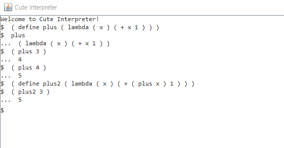

<h2>Cute19-Parser</h2>
2019 CNU Programming Language Homework

<h2>Development Environment</h2>
Java로 작성

<h2>Screen shot</h2>

<p align="center">
</img>
</p>

<h2>Part of Reports</h2>

* Cute Interpreter Define 처리 (Item 2)

```
DefineTable 클래스는 defineTable이란 HashMap static 객체를 갖는 클래스입니다. lookupTable()를 사용해 map에
접근하고, define을 통해 맵에 새 요소를 정의합니다.

isDefineStatement는 CuteParser 클래스에 정의되어 있으며, CuteParser는 객체 생성 시 input 값을 생성자 인자로
받습니다. 이 input 값이 위 함수의 인자인 str에 들어가게 되며, Scanner.stream를 통해, 각 Token 형태로 분리됩
니다. 그 후 filter를 통해 Define 타입의 토큰이 있는지를 검사하여, 문장에 define이 들어 있는지를 검사해, 존재한다
면 true를 반환합니다.

CuteInterpreter 클래스의 runFunction내 Define에서, keyNode가 define의 첫 번째 피연산자에,
valueNode가 두 번째 피연산자에 해당하며, DefineTable.define을 통해 테이블에 키 값 쌍을 저장합니다.

CuteParser 클래스의 parseExpr 메서드 내 ID 처리에서, ID 타입의 토큰을 파싱할 때,
isDefineStatement 메서드를 사용해 define 문장인지 확인하고, define 문장이라면 테이블에 키가 존재하는지 확인하
지 않고 바로 IdNode를 반환합니다. 이렇게 구현한 이유는, a란 요소가 테이블에 있다면 ( define a 5 ) 등의 문장으
로 a를 재정의하려 할 때, 이 문장이 ( define (IntNode) 5 ) 식으로 바뀌어 예외가 나는 것을 처리하기 위한 것입니
다. 반면 define 문장이 아닐 땐, ( + a 3 ) 같은 문장에선 a란 key가 테이블에 존재하는지 확인해서 존재하지 않는
경우, a란 IdNode를 그대로 반환하고 (문장이 그대로 반환됨) key가 테이블에 존재하는 경우, 테이블에 저장해 놓은
Node를 반환하기 위한 것입니다.

isInBuildInFunction는 빌트인 함수를 사용하기 위해 만든 함수입니다. clear를 입력하면 파싱 과정을 거치지 않고 위
함수에서 콘솔을 clear하는 작업을 진행합니다. setErrBuffer는 Console 이외의 클래스에서 에러가 발생했을 때

errBuffer에 대응하는 오류 메시지를 넣어놓고, 콘솔에 출력하기 위한 에러처리 메서드입니다.

콘솔 객체는 1 개만 있으면 충분하기 때문에, 싱글톤으로 만들어 전역에서 접근 가능하게 만들었습니다. errBuffer는

에러를 출력하는데 사용하는 변수이고, 매 입력 때 마다 비워집니다.
```

* Cute Interpreter Lambda 처리 (Item 3)

```
lambda식은 기본적으로 formal parameter와 식이 오고, 그 뒤에 actual parameter가 주어질 수 있다.
actual parameter의 유무는 ListNode 밖에서 확인해야 하기 때문에 ListNode를 처리할 때,
그 ListNode 안에 actual parameter가 있는지 확인해서 case를 나눈다.

Actual parameter 존재
CuteInterpreter에 스택구조인 변수 temporalVariables이 존재한다.
Lambda식의 뒤에 오는 ListNode의 car은 formal parameter를,
cdr은 expression을 표현한다.
formal parameter의 car을 확인해서 IdNode이면 formal parameter가
actual paramter로 binding되지 않은 것이기 때문에 bindArguments 함수를 사용해서
formal paramter를 actual parameter로 bind 해준다.
그 다음 define된 정보를 바탕으로 한 새로운 parsing tree를 생성한다.
새로운 parsing tree를 runExpr를 통해 계산해준다.
새로운 parsing tree를 계산하게 되면, formal parameter는 IdNode가 아니기 때문에
temporalVariables에 저장된 formal parameter를 unBind해서 defineTable에서
제거해준다. 그 후 temporalVariables에 있는 formal parameter를 제거,
expression을 계산한 결과를 반환한다.

1-1. bindArguments(ListNode arg, ListNode val)
bindArguments는 arg의 car와 val car을 하나씩 defineTable에 저장하고,
temporalVariables에 arg의 문자열을 push한다.
이후에 다음 arg와 val을 bind 하기 위해 bindArguments를 재귀적으로 호출한다.
bindArguments 함수는 arg의 cdr을 확인해서 EMPTYLIST일 경우 종료가 된다.

1-2. unBindArguments(Stack arg)
arg에는 temporalVariables가 들어오게 된다.
temporalVariables는 stack이므로 pop을 하며 stack에서 값을 제거하고 반환된 문자열
을 이용해 DefineTable 값을 제거해준다.
이 과정을 재귀적으로 반복해 stack의 size가 0 이 되면 남은 문자열이 존재하지 않는 것이므
로 unBind를 중단한다.

Actual parameter 존재하지 않을 때
Lambda 식 ListNode 전체를 계산하지 않고 반환한다.
ListNode에 toString 함수 구현
formal parameter를 바탕으로 생성된 parsing tree 대신 actual parameter로 새로
운 parsing tree를 생성하기 위해 ListNode를 문자열 형태로 바꿔서, cuteparser를 새
로 생성하고, 다시 parsing tree를 만든다.
따라서 ListNode에 toString 함수를 만들어 ListNode를 재귀적으로 돌면서 String으로
만들어 반환한다.

```
